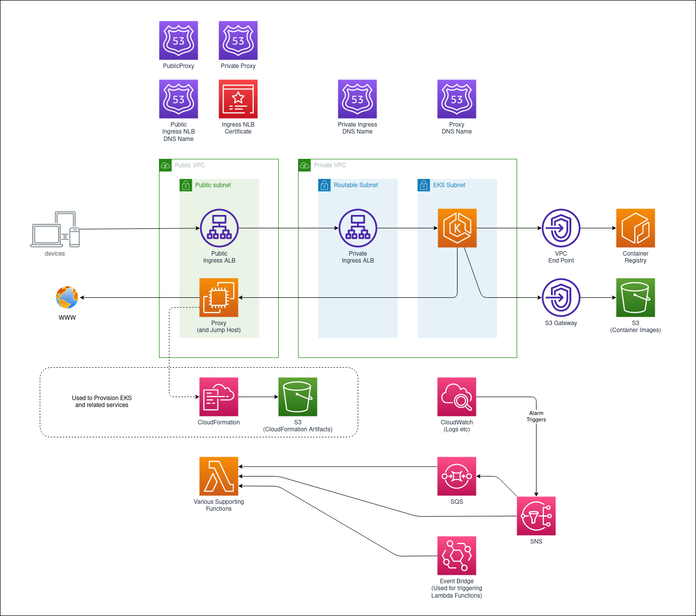

# aws-eks-private

CloudFormation Templates and Scripts to deploy EKS in a Private Only VPC

# Overview

This repository aims to include resources and supporting scripts and documentation to deploy and maintain an AWS EKS Cluster deployed in a Private Network only.

The current status of this project is still in early development.

## AWS Components

## EKS Components

