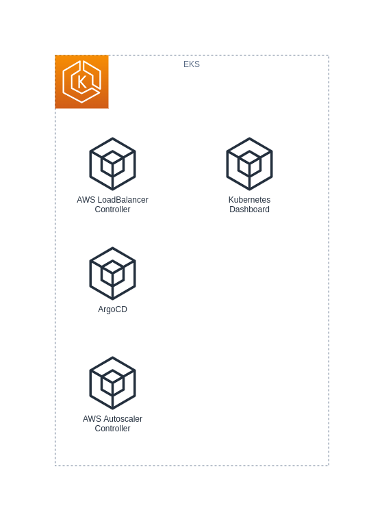

- [aws-eks-private](#aws-eks-private)
- [Overview](#overview)
  - [AWS Components](#aws-components)
  - [EKS Components](#eks-components)
- [Preparation and Pre-requisites](#preparation-and-pre-requisites)
  - [Preparing a Python Virtual Environment](#preparing-a-python-virtual-environment)
  - [AWS Account Preparations](#aws-account-preparations)
    - [Route 53 Zone](#route-53-zone)
    - [Bootstrapping a Public EC2 Jump Host (OPTIONAL)](#bootstrapping-a-public-ec2-jump-host-optional)

# aws-eks-private

CloudFormation Templates and Scripts to deploy EKS in a Private Only VPC

# Overview

This repository aims to include resources and supporting scripts and documentation to deploy and maintain an AWS EKS Cluster deployed in a Private Network only.

The current status of this project is still in early development.

## AWS Components


## EKS Components



# Preparation and Pre-requisites

The following must be available on your system:

* Python 3.8.13 or later
* AWS CLI 2.7.7 or later ([installation instruction](https://docs.aws.amazon.com/cli/latest/userguide/getting-started-install.html))
* Git version 2.36.1 or later
* EksCtl 0.101.0 or later ([installation instruction](https://docs.aws.amazon.com/eks/latest/userguide/eksctl.html))
* Kubectl client version 1.24 or later ([installation instruction](https://kubernetes.io/docs/tasks/tools/install-kubectl-linux/))
* Docker version 20.10.16 or later

_**Note**_: Older version of the software may work, but the versions above was used during the development and is therefore known to work

All command examples will assume a Unix like operating system with either BASH or ZSH as the shell. Windows users should consider using WSL with the latest Ubuntu distribution.

In addition you must obviously also have access to AWS. If you do not yet have an account, head over to [AWS and create a free account](https://aws.amazon.com/free/).

In terms of basic knowledge and experience that is required to follow along, consider the following as minimum:

* Good working knowledge of common Linux commands, including tools like `vim`, `tar`, `less`, `tail`, `cat`, `grep` etc. 
* Be comfortable with navigating the Linux filesystem
* Understand concepts like STDIN and STDOUT, pipes, redirection etc.
* Know how to install software using a package manager (`apt` or `rpm` - based on your distribution of choice)
* Have some basic prior experience in provisioning and using AWS services like `S3`, `EC2`, `Lambda` etc. Working knowledge of `CloudFormation` is also required. Be comfortable using the AWS CLI.
* Have some prior working experience with Kubernetes clusters and be comfortable with tools like `kubectl`, `kustomize` etc.
* Good working knowledge of Docker, including tagging images and uploading images to private repositories

_**WARNING**_: Although a new AWS account has a free tier, the nature of EKS is not completely covered by the free tier, and some costs are expected. You can use the [AWS Pricing Calculator](https://calculator.aws/#/) to estimate your costs, assuming you have studied the CloudFormation templates and know which services will be created. Based on experience (from early 2022), you can expect around charges of less than US$10 per day of running all the stacks. You may also want to check out how you can [control your AWS costs as described in this AWS page](https://aws.amazon.com/getting-started/hands-on/control-your-costs-free-tier-budgets/)

> If you are planning to use this just for learning or experimentation, please consider deleting all stacks as soon as possible.

## Preparing a Python Virtual Environment

_**Note**_: If you use a service like [GitPod](https://gitpod.io/), you can skip this step as you already have a unique development environment.

Once you have cloned this repository, change into the project directory and run the following commands:

```shell
# Create the Virtual Environment
python3 -m venv venv

# Change into the virtual environment
. venv/bin/activate
```

## AWS Account Preparations

Creating a new AWS account should also create you a default VPC. This will be 100% fine to use as the "public" VPC.

Consider using an EC2 instance in the public VPC from where AWS CLI commands can be run. The AWS Administrator role could be assigned to this EC2 instance, as you will need to deploy CloudFormation templates and also run various AWS CLI commands. 

_**WARNING**_: For better security, use the EC2 instance with no execution role attached amd once logged in, manually set the AWS credentials of an IAM user with API credentials. Using environment variables are recommended, for example, you could use the following:

```shell
export AWS_ACCESS_KEY_ID=XXXXXXXXXXXXXXXXXXXX
export AWS_SECRET_ACCESS_KEY=xxxXXXxxxXXXxxxXXXxxxXXXxxxXXXxxxXXXxxxX
export AWS_REGION=eu-central-1
export AWS_DEFAULT_REGION=eu-central-1
export AWS_DEFAULT_OUTPUT=yaml
export AWS_PAGER=less
```

> Once you log out of the EC2 terminal session, or when the EC2 instance is stopped, the environment variables are deleted.

If you plan to use an EC2 instance to also deploy the CloudFormation stacks and run the other commands, note the pre-requisites listed above and ensure that it is also installed on the Instance.

### Route 53 Zone

A route 53 zone is assumed to pre-exist. This project does not create a new zone.

To obtain a list of your hosted zones, run the following command:

```shell
aws route53 list-hosted-zones
```

Example output:

```yaml
HostedZones:
- CallerReference: XXXXXXXX-XXXX-XXXX-XXXX-XXXXXXXXXXXX
  Config:
    Comment: my personal site
    PrivateZone: false
  Id: /hostedzone/XXXXXXXXXXXXXX
  Name: example.tld.
  ResourceRecordSetCount: 8
```

You will need the `Id` value from one _PUBLIC_ zone and one _PRIVATE_ you want to use. DNS records for the Jump host will be added to these zones.

The private zone is used by hosts in the EKS VPC to resolve the HTTP Proxy host.

### Bootstrapping a Public EC2 Jump Host (OPTIONAL)

In this section steps to create a Jump Host will be provided and explained.

The following will be created:

* An EC2 KeyPair ([more info](https://docs.aws.amazon.com/AWSEC2/latest/UserGuide/ec2-key-pairs.html)), with instructions on how to create, obtain and use the key.
* An EC2 instance, based of an official Amazon EC2 distribution (AMI), with the Squid Proxy also installed (we will use this same instance as a Web Proxy server for instances in our Private only VPC). The image will include the following software:
  * AWS CLI
  * EksCtl
  * Kubectl
  * Git
  * Vim
  * curl
  * Squid

_**Note**_: Refer to [this page](https://aws.amazon.com/blogs/compute/query-for-the-latest-amazon-linux-ami-ids-using-aws-systems-manager-parameter-store/) on strategies for ensuring you are always launching the latest Amazon EC2 Linux Image (also referred to as an AMI, or Amazon Machine Image)

_**Important**_: This version of the CloudFormation template creates an EC2 instance with no execution role attached. When logged in using SSH, the AWS credentials need to be set with environment variables (recommended) or with the appropriate credentials files in the `~/.aws/` directory.

TODO - Provide an example CloudFormation template and scripts to provision an EC2 instance that can be used as Jump Host and from where all commands could be executed.
